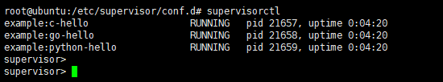
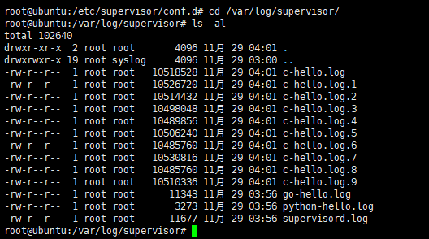

# example4supervisor
Supervisor服务的简单介绍和使用示例

#### 一、supervisor简介

​	Supervisor是用Python开发的一套通用的进程管理程序，能将一个普通的命令行进程变为后台daemon，并监控进程状态，异常退出时能自动重启。它是通过fork/exec的方式把这些被管理的进程当作supervisor的子进程来启动，这样只要在supervisor的配置文件中，把要管理的进程的可执行文件的路径写进去即可。也实现当子进程挂掉的时候，父进程可以准确获取子进程挂掉的信息的，可以选择是否自己启动和报警。supervisor还提供了一个功能，可以为supervisord或者每个子进程，设置一个非root的user，这个user就可以管理它对应的进程。

#### 二、supervisor安装

```bash
# CentOS安装
yum install supervisor

# Debian/Ubuntu可通过apt安装
apt-get install supervisor

# pip安装
pip install supervisor

# easy_install安装
easy_install supervisor
```

#### 三、配置文件说明（备注：一般不用修改，除非想开启supervisor的web功能）

```ini
[unix_http_server]
file=/tmp/supervisor.sock   ;UNIX socket 文件，supervisorctl 会使用
;chmod=0700                 ;socket文件的mode，默认是0700
;chown=nobody:nogroup       ;socket文件的owner，格式：uid:gid
 
;[inet_http_server]         ;HTTP服务器，提供web管理界面
;port=127.0.0.1:9001        ;Web管理后台运行的IP和端口，如果开放到公网，需要注意安全性
;username=user              ;登录管理后台的用户名
;password=123               ;登录管理后台的密码
 
[supervisord]
logfile=/tmp/supervisord.log ;日志文件，默认是 $CWD/supervisord.log
logfile_maxbytes=50MB        ;日志文件大小，超出会rotate，默认 50MB，如果设成0，表示不限制大小
logfile_backups=10           ;日志文件保留备份数量默认10，设为0表示不备份
loglevel=info                ;日志级别，默认info，其它: debug,warn,trace
pidfile=/tmp/supervisord.pid ;pid 文件
nodaemon=false               ;是否在前台启动，默认是false，即以 daemon 的方式启动
minfds=1024                  ;可以打开的文件描述符的最小值，默认 1024
minprocs=200                 ;可以打开的进程数的最小值，默认 200
 
[supervisorctl]
serverurl=unix:///tmp/supervisor.sock ;通过UNIX socket连接supervisord，路径与unix_http_server部分的file一致
;serverurl=http://127.0.0.1:9001 ; 通过HTTP的方式连接supervisord
 
; [program:xx]是被管理的进程配置参数，xx是进程的名称
[program:xx]
command=/opt/apache-tomcat-8.0.35/bin/catalina.sh run  ; 程序启动命令
autostart=true       ; 在supervisord启动的时候也自动启动
startsecs=10         ; 启动10秒后没有异常退出，就表示进程正常启动了，默认为1秒
autorestart=true     ; 程序退出后自动重启,可选值：[unexpected,true,false]，默认为unexpected，表示进程意外杀死后才重启
startretries=3       ; 启动失败自动重试次数，默认是3
user=tomcat          ; 用哪个用户启动进程，默认是root
priority=999         ; 进程启动优先级，默认999，值小的优先启动
redirect_stderr=true ; 把stderr重定向到stdout，默认false
stdout_logfile_maxbytes=20MB  ; stdout 日志文件大小，默认50MB
stdout_logfile_backups = 20   ; stdout 日志文件备份数，默认是10
; stdout 日志文件，需要注意当指定目录不存在时无法正常启动，所以需要手动创建目录（supervisord 会自动创建日志文件）
stdout_logfile=/opt/apache-tomcat-8.0.35/logs/catalina.out
stopasgroup=false     ;默认为false,进程被杀死时，是否向这个进程组发送stop信号，包括子进程
killasgroup=false     ;默认为false，向进程组发送kill信号，包括子进程
 
;包含其它配置文件
[include]
files = relative/directory/*.ini    ;可以指定一个或多个以.ini结束的配置文件
```

#### 四、supervisor命令说明

```bash
supervisorctl status all       //查看所有进程的状态
supervisorctl stop all         //停止所有进程的状态
supervisorctl start all        //启动所有进程的状态
supervisorctl restart all      //重启es
supervisorctl update           //配置文件修改后使用该命令加载新的配置
supervisorctl reload           //重新启动配置中的所有程序
# 当然也可以对单个进程或者进程组进行操作
```

#### 五、代码示例和配置

1. ##### Python代码示例

   ```Python
   from flask import Flask
   
   app = Flask(__name__)
   
   
   @app.route('/')
   def index():
       out_put = 'Hello world!'
       print('Response is {}'.format(out_put))
       return "<h1>{}</h1>".format(out_put)
   
   
   if __name__ == '__main__':
       app.run(host='0.0.0.0', port=5000, debug=True)
   
   ```

2. ##### Golang代码示例

   ```go
   package main
   
   import (
   	"github.com/gin-gonic/gin"
   	"net/http"
   )
   
   func main() {
   	router := gin.Default()
   
   	router.GET("/", func(c *gin.Context) {
   		msg := "Hello, Welcome Gin World!"
   		c.JSON(http.StatusOK, msg)
   	})
   	err := router.Run(":9000")
   	if err != nil {
   		panic(err)
   	}
   }
   ```

3. ##### C代码示例

   ```C
   #include <stdio.h>
   #include <unistd.h>
   
   int main(void)
   {
   	while (1){
   		printf("Hello World!\n");
   		usleep(1);
   	}
   	return 0;
   }
   ```

4. ##### supervisor配置文件（备注：/etc/supervisor/conf.d/example.conf）

   ```ini
   [group:example]
   programs=c-hello, go-hello, python-hello
   
   [program:c-hello]
   command=/opt/example4supervisor/c-example/hello
   directory=/opt/example4supervisor/c-example
   user=root
   autostart=true
   autorestart=true
   startsecs=10
   redirect_stderr=true
   stdout_logfile=/var/log/supervisor/c-hello.log
   stdout_logfile_maxbytes = 10MB
   stdout_logfile_backups = 10
   killasgroup=true
   stopasgroup=true
   
   [program:go-hello]
   command=/opt/example4supervisor/go-example/go-hello
   directory=/opt/example4supervisor/go-example
   user=root
   autostart=true
   autorestart=true
   startsecs=10
   redirect_stderr=true
   stdout_logfile=/var/log/supervisor/go-hello.log
   stdout_logfile_maxbytes = 10MB
   stdout_logfile_backups = 10
   killasgroup=true
   stopasgroup=true
   
   [program:python-hello]
   command=/opt/example4supervisor/python-example/venv/bin/python main.py
   directory=/opt/example4supervisor/python-example
   user=root
   autostart=true
   autorestart=true
   startsecs=10
   redirect_stderr=true
   stdout_logfile=/var/log/supervisor/python-hello.log
   stdout_logfile_maxbytes = 10MB
   stdout_logfile_backups = 10
   killasgroup=true
   stopasgroup=true
   
   GRANT ALL PRIVILEGES ON *.* TO 'la'@'localhost';
   ```

#### 六、结果展示





1. **不用将服务封装成守护进程服务（备注：可以减少很多代码量，并且本地开发环境中就可以调适，主要针对审计中间件和防火墙中间件）**
2. **日志可以实现保存和自动回滚，不用自己在代码中去实现日志回滚**
